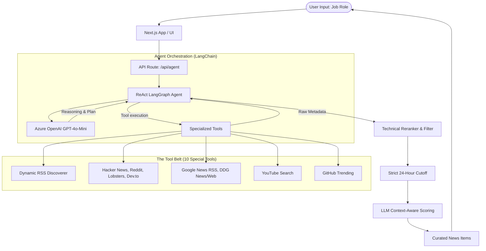

# Tech Trend Intelligence Agent

An autonomous reasoning and acting (ReAct) AI agent built with Next.js, LangChain, and Azure OpenAI, designed to autonomously research, filter, and curate technical news based on specific job roles perfectly tuned for your engineering stack.

## 🏗️ System Architecture



## ✨ Features

- **ReAct Execution**: Operates autonomously using large language model reasoning to determine the best domains and sources to search for news depending on the requested job role (e.g. searching 'r/devops' dynamically).
- **Zero-Noise 24-Hour Pipeline**: Every tool natively strips news older than 24 hours either via API parameters or internal date threshold scraping, ensuring completely rolling news and fresh data.
- **Context-Aware Reranker**: Employs a secondary agentic reranker to score the news purely on technical impact, applying severe penalties to non-actionable fluff (like politics or IPOs).
- **RSS Discovery Engine**: Includes a custom algorithm to scan arbitrary technical blogs or framework landing pages and autonomously resolve hidden XML/Atom/RSS feeds.
- **Firecrawl Fallback**: If standard RSS is unavailable (e.g., Anthropic or Mistral announcements), it falls back to parsing web metadata with Firecrawl.

## 🛠️ Stack

- **Framework**: Next.js 14 (App Router)
- **Agent Orchestration**: LangChain, LangGraph
- **LLM**: Azure OpenAI (GPT-4o-Mini)
- **Tools Integrations**: Algolia HN API, Google News RSS, DuckDuckGo SDK, YouTube Data API v3, Mendable Firecrawl
- **Styling**: Tailwind CSS

## ⚙️ Setup

Create a `.env` file containing the following:
```env
# Required AI
AZURE_OPENAI_API_KEY=...
AZURE_OPENAI_API_INSTANCE_NAME=...
AZURE_OPENAI_API_DEPLOYMENT_NAME=...
AZURE_OPENAI_API_VERSION=...

# Scraping APIs
YOUTUBE_API_KEY=...
FIRECRAWL_API_KEY=...
```

Run the development server:
```bash
npm run dev
# or
yarn dev
```

Open [http://localhost:3000](http://localhost:3000) with your browser to see the result.
